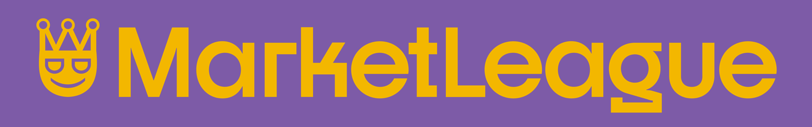

# MarketLeague
St. Edward's University Senior Project repository for MarketLeague, a fantasy-football style approach to learning about the stock market. Users will be able to create a portfolio of stocks that act like trading cards, and users will be able to join leagues where they can trade stocks with other players.

## Running MarketLeague Locally
Requirements:
[Docker v27.2.0](https://www.docker.com/products/docker-desktop/)
```sh
./run_docker_dev.sh
```
This will run the `docker-compose.dev.yml` and will run the dev environments for the Angular Frontend and Gin Backend. Both will be updated as changes are made live.

### .env file
In order for MarketLeague to run correctly locally you will need to create a `.env` file with these properties:
```
POSTGRES_USER=user
POSTGRES_PASSWORD=password
POSTGRES_DB=database
JWT_KEY=secretkey
```
Change `user`, `password`, and `database` to appropriate values.

## MarketLeague Roadmap
Projected plan for features and presentations.


## Credits & Thanks
Thanks to Liam Molina for creating the logo for MarketLeague!
- [Instagram](https://www.instagram.com/designedbyliamm/)
- [LinkedIn](https://www.linkedin.com/in/liam-molina-ab3211290/)

## Creators:
#### Timothée Pommier
- [LinkedIn](https://www.linkedin.com/in/timoth%C3%A9e-pommier-81749a251/)
- [GitHub](https://github.com/TimotheePommier)
#### Ricky Yoshioka
- [LinkedIn](https://www.linkedin.com/in/r1chard-yoshioka/)
- [GitHub](https://github.com/ricky-yosh)

## Resources
- [unDraw Illustrations](https://undraw.co/illustrations)
- [Docker](https://www.docker.com/)
- [Angular](https://angular.dev/)
- [Go](https://go.dev/)
- [Digital Ocean Droplet](https://www.digitalocean.com/)
- [Postman](https://www.postman.com/)
- [Sourcetree](https://www.sourcetreeapp.com/)
- [VSCode](https://code.visualstudio.com/)
- [Slack](https://slack.com/)

## MarketLeague Version
v4.0

